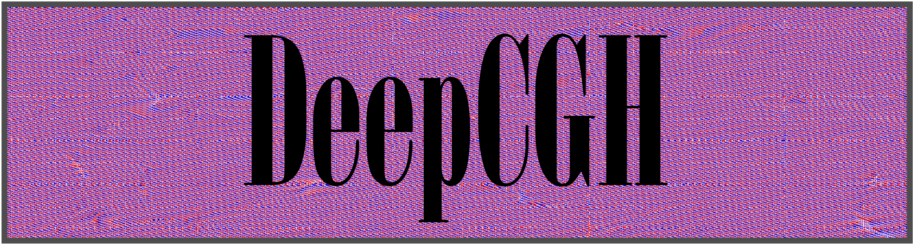
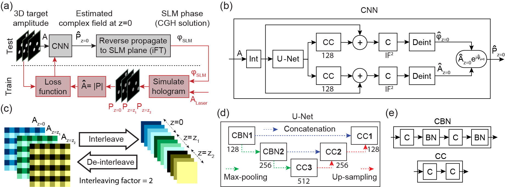

# DeepCGH: 3D computer generated holography using deep learning
DeepCGH is an *unsupervised*, *non-iterative* algorithm for computer generated holography. DeepCGH relies on convolutional neural networks to perform *image plane* holography in real-time.
For more details regarding the structure and algorithm refer to the [associated manuscript](https://www.osapublishing.org/oe/abstract.cfm?uri=oe-28-18-26636) [1]. Please also see our copyright and permission notice in `copyright.pdf`.

For a hands on tutorial you can also see the [`DeepCGH_tutorial.ipynb`](https://colab.research.google.com/drive/1s9zPDb6TArwB4FSUBiUBIuVr9SdtrXnM?usp=sharing) available both on google colab and as a Jupyter Notebook (`tutorial.ipynb`).

## Installation Guide and Dependencies:
Here we provide a Python and Tensorflow implementation of DeepCGH. The current version of this software does not require explciit installation. Dependencies include:
```
python 3.x
tensorflow-gpu >= 2.0.0
h5py
scipy
skimage
tqdm
```
If you have Python 3.x (preferrably > 3.7), you can easily install package requirements by executing the following command in **Ubuntu** terminal or Anaconda Prompt on **Windows**:
```
pip install tensorflow-gpu==2.3.0 h5py scipy skimage tqdm
```
This software was not tested on **Mac OS** but theoretically it should run smoothly independent of the OS.
After the installation of packages is complete, you can clone this repository to your machine using:
```git clone https://github.com/UNC-optics/DeepCGH.git```

## Usage
### For Users
After cloning the repository (see previous section), you can run the demo `demo_infinity_loop.py` for a simple inifinity loop example. In this demo:

First, the parameters of the simulated training dataset are determined:
```
data = {
        'path' : 'DeepCGH_Datasets/Disks',
        'shape' : (1152, 1920, 1),
        'object_type' : 'Disk',
        'object_size' : 10,
        'object_count' : [27, 48],
        'intensity' : [0.2, 1],
        'normalize' : True,
        'centralized' : False,
        'N' : 10000,
        'train_ratio' : 9000/10000,
        'file_format' : 'tfrecords',
        'compression' : 'GZIP',
        'name' : 'target',
        }
```
Please note that you can also provide other datasets (such as natural images) as training data (instructions coming soon).
The parameters in this dictionary are:
1. `'shape'` : The spatial dimensions and number of depth planes of the holograms are determined by the `shape` parameter. The convention is (y_dimension, x_dimention, number_of_planes).
2. `'path'` : determines the directory at which the dataset file is stored
3. `'object_type'` : either `'Disk'`, `'Line'`, or `'Dot'`. Determines what kind of object should be randomly generated.
4. `'object_size'` : determines the sthe radius of Disks. If `object_type!='Disk'` then anything work. Do not leave empty.
5. `'object_count'` : determines the min and max number of objects per plane. Must be a list
6. `'intensity'` : determines the min and max of the intensity of each object. Intensities will be determined randomly.
7. `'normalize'` : a flag that determines whether the intensoty of depth planes are normalized with respect to each other. If True, the energy in each depth plane is equal.
8. `'centralized'` : focuses the location of objects in the center. This is a practical feature for real SLMs.
9. `'N'` : the number of samples
10. `'train_ratio'` : determines the portion of `N` that is used for training. The rest is used for testing.
11. `'file_format'` : determines the file format. Either `'tfrecords'` or `'hdf5'`.
12. `'compression'` : compression format for `tfrecords` dataset. Keep 'GZIP'.
13. `'name'` : the name used in `frecords` for the input of dataset. TODO: more details and features coming soon.

Please don't leave any of these fields empty even if they are not relevant to the characteristics you have in mind.

Second, the parameters of the model have to be determined. The structure of the CNN is as follows:



As can be seen on panel (d) the U-Net consists of three convolutional levels. The number of convolutional kernels at each levvel is determined by the `n_kernels` parameter. All the parameters are specified in a dictionary:
```
model = {
        'path' : 'DeepCGH_Models/Disks',
        'int_factor':16,
        'n_kernels':[ 128, 256, 512],
        'plane_distance':0.005,
        'wavelength':1e-6,
        'pixel_size':0.000015,
        'input_name':'target',
        'output_name':'phi_slm',
        'lr' : 1e-3,
        'batch_size' : 4,
        'epochs' : 1,
        'token' : '',
        'shuffle' : 4,
        'max_steps' : 100
        }
```
Accordingly, the parameters of the model are described bellow:
1. `'path'` : the path to save the checkpoints of the model as it is being trained.
2. `'int_factor'` : the interleaving factor. Refer to the manuscript for tips on determining the right values.
3. `'n_kernels'` : number of kernels for each convolutional level
4. `'plane_distance'` : the distance between depth planes. The planes are going to be equally placed around the focal point.
5. `'wavelength'` : wavelength of the laser to be use din the simulations
6. `'pixel_size'` : SLM pixel size
7. `'input_name'` : name to be used as input name in the model
8. `'output_name'` : name to be used for the output of the model
9. `'lr'` : the learning rate for training the model
10. `'batch_size'` : batch_size for training of the model
11. `'epochs'` : number of epochs to train the model for
12. `'token'` : customixed token text to be used in the saved model file name
13. `shuffle` : the number of samples to be shuffled before being fed to the model (please refer to Tensorflow Data API for more details)
14. `'max_steps'` : maximum number of training steps.

Now that the parameters are set uou can create an instance of the `DeepCGH_Datasets` module. This module will create the training dataset. For this purpose first import the module:
```
from deepcgh import DeepCGH_Datasets
```
Next you will feed the `data` dictionary to the module and instanciate a dataset:
```
dset = DeepCGH_Datasets(data)
```
If a dataset with the characteristics that you specified already exists, that will be printed in the console. Calling the `getDataset` method will generate the data and update the path to the dataset within the DeepCGH_Dataset object. If the dataset already exists a new dataset won't be generated but if the dataset doesn't exist (in the specified path) it'll be generated. A progress bar will display the progress of making the dataset.

Next, a `DeepCGH` module is instantiated according to the specified parameters:
```
dcgh = DeepCGH(data, model)
```
If the checkpoints for the model don't exist, the model will be trained from scracth when the `train` method is called. Otherwise, if the maximum number of epochs/steps is not reached the model will continue trianing. If the maximum steps/epochs is reached the model will be loaded and the multi-threaded `tf.Estimator` will be ready for real-time operation.

The CGH solution is achieved by calling the `get_hologram` method:
```
dcgh.get_hologram(data)
```

### For Developers
Coming soon (how to change the model structure, how to change the loss function, etc).


### Citation
[1] M. Hossein Eybposh, Nicholas W. Caira, Mathew Atisa, Praneeth Chakravarthula, and Nicolas C. Pégard, "DeepCGH: 3D computer-generated holography using deep learning," Opt. Express 28, 26636-26650 (2020)

